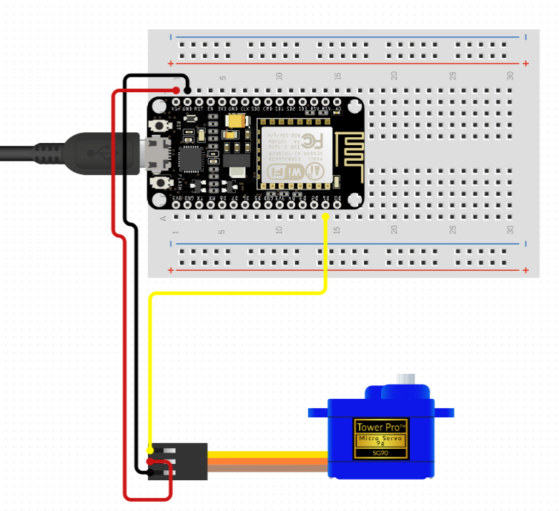

# Automated light switch with Arduino / ESP8266 Module.
## sketch_jan21a.ino 
Simple arduino script that triggers the servo motor to rotate 45 degrees in both directions, simulating the movement when turning on or off a light switch.
The triggering is done by pressing a push button that acts as a switch. Once pressed it holds position.

## esp-web-server-light-switch.ino
Script for ESP8266 that builds a Web Server that controls the servo motor. The Web Server can be accessed with any device with a browser in the local network.

